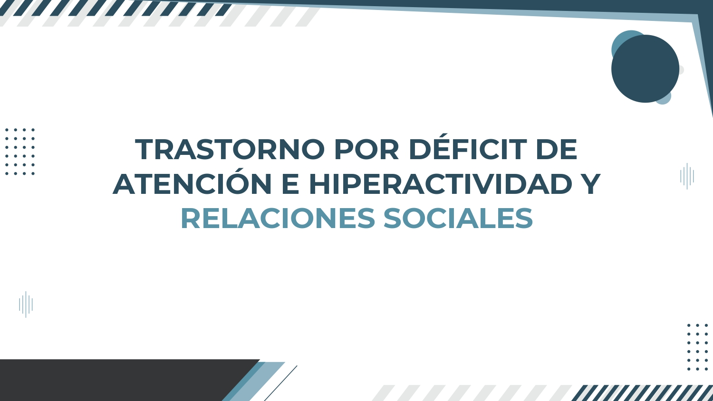
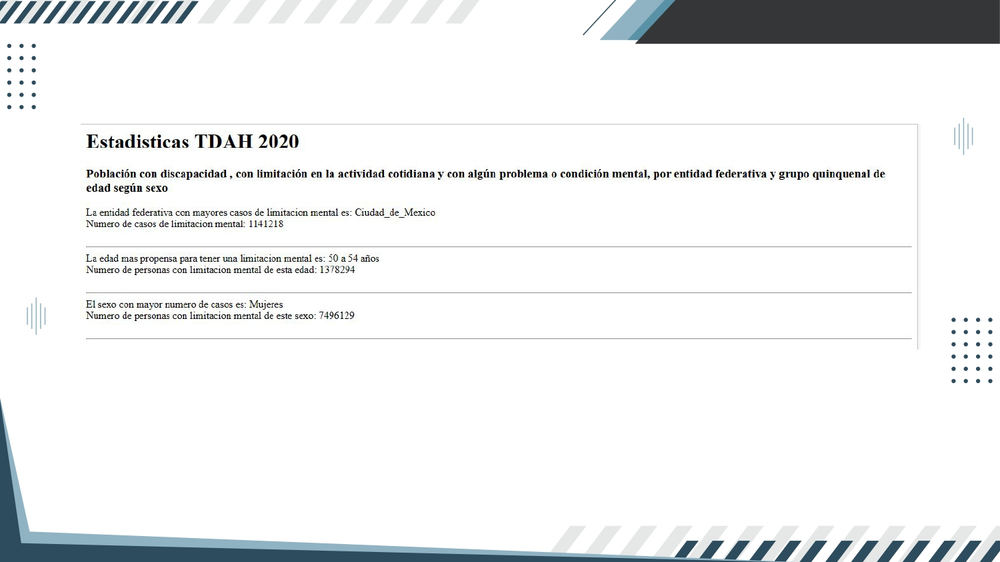

  

  
# ¿Cuál es la problemática?
Las personas tienen desinformación e ignorancia, ya que presentan etiquetas erróneas, donde buscan adjetivos sin conocer dicho trastorno mental. Muchas veces sentirse aceptado y pertenecer a un grupo es una necesidad básica en los seres humanos.
Sin embargo, en el momento que se cuestiona este tipo de trastorno mental, interfiere en el desarrollo personal y emocional. La desinformación aleja el acceso a un tratamiento eficiente.

# ¿Cómo se resolvió?
A través de los datos que se identificaron y analizaron, se creó una concientización, ya que se informó sobre estos tipos de trastornos mentales. Esto puede ayudar a disimular el miedo y la ignorancia asociado con los tipos de trastornos mentales.Para que así, se pueda tener una comunicación abiertamente, sin barreras sociales, la falta de acceso a la atención médica adecuada y la discriminación del empleo, vivienda y cualquier otro elemento.

  

# Conclusión

  
  

# Cosas positivas dentro del proyecto.

A lo largo del proyecto se obtuvo una gran cantidad de datos sobre el TDAH y los diversos trastornos mentales más comunes. Estos datos fueron precisos y coherentes, con una alta velocidad. Para que cualquier persona pueda procesarlos, identificarlos y analizarlos, para la creación de una mejor concientización a futuro.

Así mismo, se conocen nuevas plataformas para indagar en los datasets, buscar la validez de cada uno de nuestros datos y llegar a un mejor resultado.

# Discusión

En alguna parte del proyecto fue difícil encontrar datos, ya que no se contaba con el conocimiento, para buscarlos. Así mismo, en algunas plataformas se encontraban datos basura, lo cual impedía el proceso de búsqueda de datos. Algunos de estos no tenían relevancia en el tema, y se desconocía su origen.También que el proyecto puede caer en manos de personas que den un giro negativo, manipulando los datos, para realizar actos ilícitos, sin seguir alguna política de seguridad.
